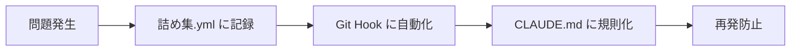

# 同じミスを繰り返さない仕組み

## 🛡️ 3層防御システム

### 1️⃣ 第1層: Git Hooks（自動チェック）

**Pre-commit hook** が以下を自動でチェック：

- ✅ Prettier フォーマット
- ✅ TypeScript 型チェック
- ✅ 不要ファイルの検出
- ✅ package.json の無許可変更

インストール方法：

```bash
bun run install-hooks
```

### 2️⃣ 第2層: 詰め集.yml（知識ベース）

**作業開始前に必ず確認**：

- 過去の失敗事例
- 解決策と教訓
- よくある間違い
- ベストプラクティス

### 3️⃣ 第3層: CLAUDE.md ルール（行動規範）

**厳格なルール**：

- ファイル作成前に既存確認
- 依存関係追加は要許可
- 最小限の変更
- 既存規約の遵守

## 🔄 継続的改善プロセス



## 📋 チェックリスト運用

### コミット前チェック（自動）

```bash
# Git hook が自動実行
✓ Prettier チェック
✓ TypeScript チェック
✓ 不要ファイルチェック
✓ 依存関係チェック
```

### プッシュ前チェック（手動）

```bash
bun run format:check  # Prettier
bun run typecheck     # TypeScript
bun test             # テスト
git status           # 不要ファイル
```

## 🚨 エラー時の対処

### Prettier エラー

```bash
bun run format  # 自動修正
```

### TypeScript エラー

```bash
# エラー内容を確認して修正
bun run typecheck
```

### 不要ファイル

```bash
# .gitignore に追加 or 削除
echo "pattern" >> .gitignore
```

## 💡 ミス防止の心得

1. **急がば回れ**: チェックを省略しない
2. **記録第一**: 新しい問題は必ず詰め集.yml へ
3. **自動化推進**: 繰り返しミスは Git Hook へ
4. **共有意識**: チーム全体でミスを防ぐ

## 🔧 システムメンテナンス

### Git Hooks 更新時

```bash
# Hook を再インストール
bun run install-hooks
```

### 新しいミスパターン発見時

1. 詰め集.yml に追加
2. 可能なら Git Hook に組み込み
3. CLAUDE.md のルール更新を検討

---

**Remember**: ミスは成長の機会。記録し、自動化し、共有することで、チーム全体が強くなる。
