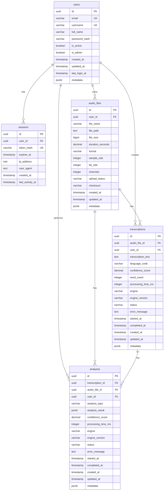

# TeleAI Enterprise データベース ER図

## エンティティ関係図

## 関係性の説明

### 1対多の関係

1. **users → audio_files**
   - 1人のユーザーは複数の音声ファイルを所有できる
   - 音声ファイルは必ず1人のユーザーに属する

2. **users → sessions**
   - 1人のユーザーは複数のセッションを持つことができる
   - セッションは必ず1人のユーザーに属する

3. **audio_files → transcriptions**
   - 1つの音声ファイルは複数の文字起こし（異なるエンジンや設定）を持つことができる
   - 文字起こしは必ず1つの音声ファイルに基づく

4. **transcriptions → analyses**
   - 1つの文字起こしは複数の分析（感情分析、要約、キーワードなど）を持つことができる
   - 分析は必ず1つの文字起こしに基づく

### カスケード削除

- ユーザーが削除されると、関連するすべてのデータ（セッション、音声ファイル、文字起こし、分析）が削除される
- 音声ファイルが削除されると、関連する文字起こしと分析が削除される
- 文字起こしが削除されると、関連する分析が削除される

### インデックス戦略

主要なインデックス：
- 複合インデックス: `(user_id, created_at)` - ユーザーごとの時系列データ取得
- 全文検索インデックス: 文字起こしテキストの高速検索
- ステータスインデックス: 処理状態でのフィルタリング
- 部分インデックス: 完了済みレコードのみのインデックス（パフォーマンス向上）